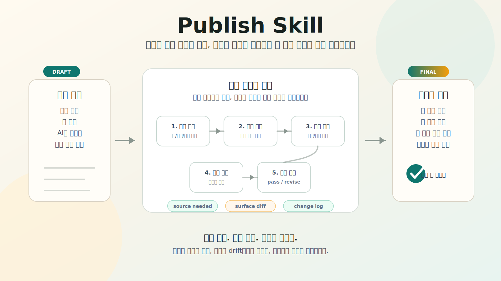

<h1 align="center">Publish Skill</h1>

<p align="center">
  <a href="README.en.md"></a>
</p>

<p align="center">
  
  
  
  
  
  
  
  
  
  
  
  
</p>

<p align="center">
  
</p>

<p align="center"><strong>Publish Skill은 초안을 바로 예쁘게 고치는 도구가 아닙니다.</strong></p>

<p align="center">사실을 먼저 가르고, 근거 없는 확신을 낮추고, 논리의 빈칸을 메운 뒤, 마지막에 사람의 목소리로 출판 가능한 문장을 만듭니다.</p>

## 왜 필요한가

대부분의 글쓰기 도구는 문장을 너무 빨리 다듬습니다. 그 결과 논리 비약, 과장, 출처 없는 수치, AI식 상투구가 더 매끈한 문장 안에 숨어버립니다.

Publish Skill은 반대로 움직입니다.

```text
주장 추출 -> 근거 점검 -> 논리 게이트 -> 문체 패스 -> 의미 차이 점검 -> 최종 판정
```

그래서 보고서, 칼럼, 제안서, 연설문, 블로그 글, LinkedIn 글처럼 “좋아 보이는 문장”보다 “믿고 낼 수 있는 글”이 중요한 작업에 맞습니다.

## 핵심 기능

- 사실, 해석, 의견, 전망, 추천을 분리합니다.
- overclaim, causal leap, unsupported certainty, 약한 도입부와 결론을 잡습니다.
- 논리 게이트를 통과한 뒤에만 문체를 강하게 다듬습니다.
- 글쓴이의 관점과 목소리를 보존하면서 AI스러운 리듬을 줄입니다.
- `final_draft`, `change_log`, `evidence_registry`, `logic_gate`, `style_gate`, `final_verdict`를 남깁니다.
- 사용자가 요청하거나 제공하지 않은 출처, 링크, 논문명, 통계, 기관명을 만들지 않습니다.

## 설치

Codex 스킬 폴더에 클론합니다.

```bash
git clone https://github.com/Pandoll-AI/publish-skill.git ~/.codex/skills/publish-skill
```

이미 체크아웃한 폴더가 있다면 심볼릭 링크로 등록해도 됩니다.

```bash
ln -s /path/to/publish-skill ~/.codex/skills/publish-skill
```

Codex에서 이렇게 요청합니다.

```text
Use $publish-skill to polish this draft for publication with fact, logic, and style checks.
```

## 로컬 실행

네트워크 없이 결정적 스캐폴드를 실행할 수 있습니다.

```bash
python3 scripts/orchestrate_publish.py \
  --draft examples/korean_blog_draft.md \
  --output outputs/example_run \
  --language ko \
  --mode standard_publish \
  --fact-check mixed
```

출력 검증:

```bash
python3 scripts/validate_outputs.py outputs/example_run
```

테스트:

```bash
python3 tests/run_tests.py
```

## 모드

- `quick_polish`: 짧고 낮은 위험도의 문장 정리.
- `standard_publish`: 기본 출판 전 최종 패스.
- `publish_gate`: 엄격한 출판 가능 판정.
- `high_risk_review`: 의료, 법률, 금융, 안전, 공공정책 주장에 대한 엄격 검토.
- `voice_rewrite`: 글쓴이의 목소리를 보존하는 리라이트.
- `explain_for_beginner`: 근거 없는 예시를 더하지 않는 쉬운 설명.

## 원칙

Publish Skill은 출처를 지어내지 않습니다. 근거가 없으면 `source needed`로 표시하거나, 문장의 강도를 낮추거나, 삭제합니다.

문체는 마지막입니다. 먼저 사실과 논리를 통과해야 합니다.

## 변경 기록

변경 사항은 [CHANGELOG.md](CHANGELOG.md)를 확인하세요.

## 라이선스

MIT
